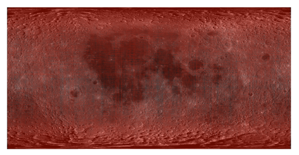
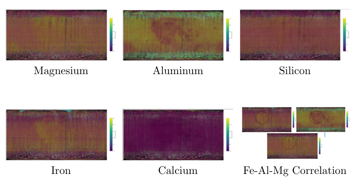
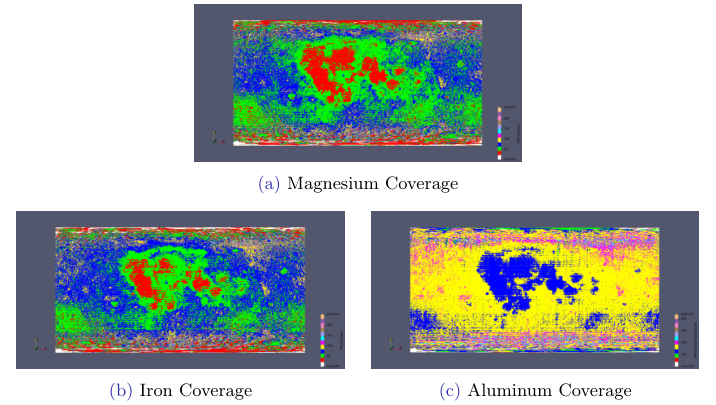
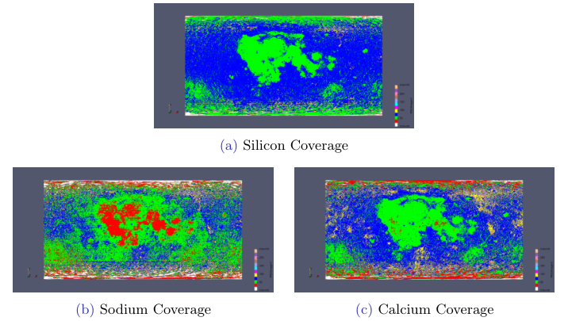
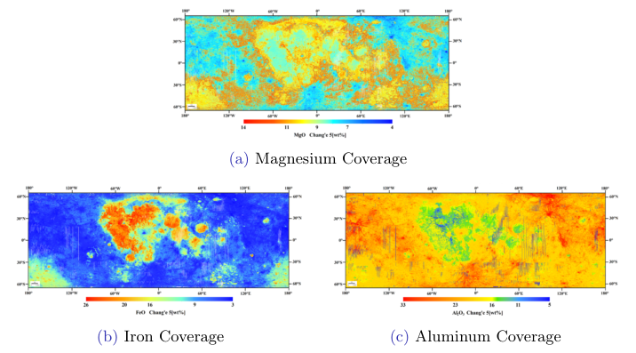

# Chandrayaan-2 — Inter IIT ISRO Problem Statement

**Surface-composition mapping of the Moon from CLASS X-ray fluorescence spectra**

A reproducible pipeline that takes raw X-ray spectra recorded by the CLASS instrument aboard
Chandrayaan-2 and turns them into two map products: a set of static per-element abundance
overlays, and a browser-based viewer in which every 12.5 km patch of the lunar surface can be
queried for its elemental ratios and their uncertainties.


---

## Contents

- [The measurement](#the-measurement)
- [What the pipeline does](#what-the-pipeline-does)
- [Repository layout](#repository-layout)
- [Setup](#setup)
- [Running the pipeline](#running-the-pipeline)
- [Inputs and outputs](#inputs-and-outputs)
- [Results](#results)
- [Assumptions](#assumptions)
- [Known limitations](#known-limitations)
- [Data availability](#data-availability)
- [References and attribution](#references-and-attribution)

---

## The measurement

CLASS — the Chandrayaan-2 Large Area Soft X-ray Spectrometer — is a photon counter, not an
imager. Its swept-charge devices convert each incident soft X-ray into a charge pulse whose
amplitude is proportional to the photon's energy, and those pulses are binned into a
2048-channel histogram roughly twice a second. One FITS frame therefore contains one spectrum
plus the four corner coordinates of the patch of surface the detector was looking at.

The physics that makes composition mapping possible is straightforward. When a solar flare
raises the X-ray flux at the Moon, atoms in the top few tens of micrometres of regolith
fluoresce, each element emitting at a characteristic energy. Those emission lines land on
predictable detector channels, and the number of photons in a line scales with how much of that
element is present. Decompose a spectrum into its lines, integrate each one, and the result is
a set of abundance proxies for a named patch of ground — measured from orbit, without touching
the surface.

Two practical constraints shape everything downstream:

**Flares are required.** Outside a flare the fluorescence signal is buried in detector noise,
which is why the usable archive is a small fraction of total observing time and why coverage is
uneven rather than uniform.

**Single frames are too faint.** A half-second exposure does not collect enough photons for a
ten-component decomposition to converge on the weaker lines. Frames must be combined, which
trades spatial resolution for signal — a trade the pipeline makes explicitly and cheaply
(see below).



*Cumulative footprint of the frames used here, drawn on an equirectangular lunar basemap.*

---

## What the pipeline does

### 1. Separating signal from a background that moves

Every spectrum sits on a noise floor set by particle background and detector electronics, and
that floor drifts over the course of an orbit. Calibrating once against a quiet frame and
subtracting that everywhere leaves a residual that grows through the pass.

Instead, the background estimates itself continuously. Each frame is triaged by peak height:
frames too faint to contain anything are discarded, frames that are faint but clean are folded
into a running estimate of the noise floor with exponential weighting, and frames bright enough
to fit are subtracted against whatever that estimate currently holds. The background therefore
tracks the detector rather than a snapshot of it.


*Raw counts against the running background estimate. The estimate follows the floor without
being dragged upward by the emission lines sitting on top of it.*

### 2. Co-adding frames

Eight consecutive frames are summed before fitting. The number is not arbitrary: eight frames
span approximately one native CLASS footprint, about 12.5 km, so the sum costs essentially no
spatial resolution while multiplying the photons available in every line. This is the single
change that makes the ten-component fit converge reliably.

### 3. Decomposing the spectrum

Each co-added spectrum is modelled as ten Gaussians — the K-alpha lines of O, Na, Mg, Al, Si,
Ca, Ti, Mn and Fe, plus iron's L-shell feature, whose area is later added to iron's K-shell
area. The lines are not resolved: they overlap, they sit on a sloping floor, and their
amplitudes span two orders of magnitude. A single global fit across the spectrum diverges.


*What a fixed fitting window produces: oxygen swells to absorb the rising floor beneath it,
aluminium and silicon are pulled off their true channels, and the composite (red) departs from
the data. Every area derived from this is meaningless.*

The fix is to fit each line locally and more than once. Two window widths are tried per line —
a wide one that includes the continuum and biases amplitude low, a narrow one that is cleaner
but noisier at the edges — and the candidate whose fitted centre lands closest to the line's
theoretical channel is kept. The decomposition stays anchored to physics rather than to whichever
window happened to be hard-coded.

Oxygen gets special treatment. A large instrumental artefact sits immediately below its line and
the noise floor is climbing steeply there, so its window is offset to the high-channel side of
the peak and the *smallest*-area candidate is taken: the fit least polluted by the artefact.
Where the artefact's signature is detected directly, the clean right-hand flank of the peak is
mirrored back across the contaminated channels before fitting.


*The same spectrum with adaptive windows. Each component sits on its own channel and the
composite tracks the data, so the individual areas are usable as abundance proxies.*

### 4. Ratios, and why silicon is the denominator

Absolute line intensity depends on how strong the driving flare was, so raw areas from different
observations are not comparable. Every abundance in this project is therefore reported as a
ratio against silicon, which is close to uniformly distributed across the lunar surface. Dividing
by it cancels the flare dependence and leaves a quantity that reflects composition.

The cost of that choice is that any contamination of the silicon line propagates into all eight
ratios. Because the lines overlap, some fraction of what is attributed to one element genuinely
belongs to a neighbour. The overlap integral of two Gaussians has a closed form, so this
contamination is computed directly and carried through the pipeline as the uncertainty attached
to every ratio — the `±` figure that appears in the viewer tooltip.

### 5. Regridding onto a uniform grid

The catalogue describes each observation as an irregular quadrilateral, with no alignment between
consecutive rows and heavy overlap wherever orbital passes cross. Rendering that directly means
intersecting polygons per frame, and it leaves the overlap question unanswered.

Both problems are solved by recasting the data onto a regular 0.1° grid. A KD-tree is built over
the catalogue's coordinates and queried once, as a single vectorised batch, for every node in the
grid; each node inherits the ratios of its nearest observation. The query runs in compiled code
and completes in about a second for several million nodes, where the equivalent Python loop takes
minutes.

Where several catalogue rows land on the same node — the redundancy created by overlapping passes
— their values are averaged rather than overwritten. Each contributing row came from an
independently fitted spectrum, so the mean carries lower uncertainty than any single pass. Since
the 0.1° grid is finer than the 12.5 km footprint, compositional detail below the footprint scale
emerges wherever coverage is dense, with no interpolation or upsampling involved.


*Irregular track geometry on the left; the uniform grid it is recast onto on the right.*

### 6. Rendering

Two products come out of the grid.

**The composition viewer** places one marker per grid cell on a lunar albedo basemap and attaches
the full elemental readout to each. At roughly 900,000 cells, a conventional SVG scatter plot is
not an option — the browser builds one DOM node per point and stops responding long before the
dataset is on screen. Plotly's `Scattergl` trace uploads the points to the GPU as vertex buffers
instead and draws them in parallel, keeping pan, zoom and hover interactive. The tooltip payload
travels in the same upload, which is why eight ratios can be displayed with no callback and no
round trip.

| Trace | Backend | Practical ceiling | Behaviour at this scale |
|---|---|---|---|
| `Scatter` | SVG, one DOM node per point | ~10,000 points | Never finishes laying out |
| `Scattergl` | WebGL, GPU vertex buffers | 10⁶+ points | Interactive |

Markers are drawn one pixel wide on purpose. Visible density then reads as genuine coverage:
solid where many passes overlap, individual lines across the poles.

**The element overlays** work from the raw footprint geometry instead. Each catalogue row is
stroked as the quadrilateral it actually was, coloured by that element's share of total fitted
flux, and alpha-composited onto the basemap at two opacities. Drawing outlines rather than filled
polygons is what gives the figures their woven texture — overlapping tracks stay individually
visible, so each map doubles as a coverage plot.

---

## Repository layout

```
.
├── notebooks/
│   ├── 01_catalogue_per_frame.ipynb        Per-frame fitting (diagnostic variant)
│   ├── 02_catalogue_coadded_frames.ipynb   Eight-frame co-addition — the science product
│   ├── 03_regrid_catalogue.ipynb           KD-tree regridding and overlap averaging
│   ├── 04_render_composition_viewer.ipynb  WebGL viewer export
│   └── 05_render_element_overlays.ipynb    Static per-element overlay PNGs
├── docs/
│   ├── 01-instrument-and-data.md           CLASS, the archive, and the FITS frame layout
│   ├── 02-spectral-pipeline.md             Triage, background tracking, fitting, uncertainty
│   ├── 03-catalogue-schema.md              Column-by-column description of the catalogue
│   ├── 04-gridding-and-rendering.md        Regridding, averaging, and both renderers
│   └── 05-references.md                    Sources, third-party material, attribution
├── figures/                                Figures used by this documentation
├── results/
│   └── element_overlays/                   Published per-element overlay maps
├── data/                                   Empty by design — see data/README.md
├── requirements.txt
└── .gitignore
```

---

## Setup

Python 3.10 or newer.

```bash
git clone <your-fork-url>
cd Chandrayaan-2-Inter-IIT-ISRO-Problem-Statement

python -m venv .venv
source .venv/bin/activate        # Windows: .venv\Scripts\activate
pip install -r requirements.txt

jupyter lab
```

On a hosted runtime such as Colab, install the same set with `pip install -r requirements.txt`
in the first cell; each notebook also carries a commented install line covering just what it
needs.

Notebooks 01 and 02 are CPU-bound and memory-light. Notebook 03 is the demanding one: the full
0.1° grid runs to several million rows and comfortably wants 16 GB of RAM. Below that, process
the catalogue in slices and use the concatenation step provided in that notebook.

---

## Running the pipeline

The five notebooks form a chain. Each reads what the previous one wrote, and every path is
configurable through an environment variable so that nothing needs editing to move the data
elsewhere.

```bash
export CLASS_FITS_ROOT=./data/raw/class_fits
export CATALOGUE_CSV=./data/interim/coadded_catalogue.csv
export GRID_CSV=./data/interim/grid_ratios.csv
export LUNAR_BASEMAP=./data/basemap/lunar_albedo_equirect.png
```

**Step 1 — build the catalogue.** Run `02_catalogue_coadded_frames.ipynb` over the downloaded
FITS archive. It walks each month's directory in sorted order and writes one CSV per directory.
Concatenate them into a single catalogue:

```bash
python - <<'PY'
import glob, pandas as pd
parts = sorted(glob.glob("coadded_catalogue_*.csv"))
pd.concat((pd.read_csv(p) for p in parts), ignore_index=True) \
  .to_csv("data/interim/coadded_catalogue.csv", index=False)
PY
```

Run `01_catalogue_per_frame.ipynb` instead when you want to inspect how individual spectra
behave; it is the same pipeline with the batch size set to one, and its output is not what the
maps are built from.

**Step 2 — regrid.** Run `03_regrid_catalogue.ipynb`. It produces the grid table consumed by the
viewer.

**Step 3 — render.** Run `04_render_composition_viewer.ipynb` for the interactive page, and
`05_render_element_overlays.ipynb` once per element and opacity for the static maps. The element
and opacity are set in a single configuration cell at the top of notebook 05.

---

## Inputs and outputs

**Required inputs**

| Input | Description | Where to get it |
|---|---|---|
| CLASS Level-1 FITS frames | One spectrum per file: a 2048-channel `COUNTS` column, `V0_LAT`–`V3_LON` corner keywords and a `MID_UTC` timestamp | ISRO's PRADAN science data archive |
| Lunar albedo basemap | Equirectangular global mosaic spanning −180°–180° and −90°–90° | Any global lunar mosaic; see `data/README.md` |

**Products**

| Output | Produced by | Shape |
|---|---|---|
| `coadded_catalogue_<n>.csv` | Notebook 02 | One row per co-added batch: eight corner coordinates, nine line areas, eight ratio uncertainties |
| `grid_ratios.csv` | Notebook 03 | One row per 0.1° cell, each ratio stored as `"value ± uncertainty"` |
| `composition_viewer.html` | Notebook 04 | Self-contained page, no server required |
| `<el>_overlay_op{40,70}.png` | Notebook 05 | One static overlay per element and opacity |

`docs/03-catalogue-schema.md` describes every column.

---

## Results



*Overlay maps for six elements plus the three-way Fe–Al–Mg comparison.*

The most informative panel is the last one. Iron and magnesium concentrate in the same places,
aluminium is depleted in exactly those places and elevated where they are low. That three-way
anti-correlation is the geochemical signature of the Moon's fundamental crustal division:
ferromagnesian mare basalt, rich in pyroxene and olivine, against feldspathic highland
anorthosite, which is aluminium-rich by mineralogy and iron-poor.



*Magnesium, iron and aluminium. Mg and Fe both peak across Oceanus Procellarum and the nearside
mare basins; Al peaks in the far-side highlands where the crust is thickest.*



*Silicon is close to featureless, which is the empirical justification for using it as the
normalisation reference. Sodium and calcium show weaker, more diffuse structure.*

Nothing in the pipeline imposes this pattern. Each element is fitted independently, from a
separate spectral line, with no cross-element constraint — so the fact that the mafic/feldspathic
divide emerges at all is the pipeline's main internal consistency check.

### Comparison against published maps



*Published MgO, FeO and Al₂O₃ maps derived from Chang'e-5 samples with deep-learning spectral
inversion, reproduced from Yang et al. (see `docs/05-references.md`) for comparison with the
overlays above.*

The independently derived maps agree on the features that matter: magnesium and iron enriched
across Procellarum, the aluminium-rich highland ring, iron depletion through the highland
terrane. Two very different methods — sample-calibrated inversion of reflectance spectra there,
Gaussian decomposition of fluorescence spectra here — recover the same spatial structure.

---

## Assumptions

- **Silicon is uniformly distributed.** Every ratio depends on this. It is a standard assumption
  for lunar XRF work and the silicon overlay above is consistent with it, but it is an assumption,
  not a measurement.
- **Line areas are proportional to abundance.** No matrix correction, self-absorption correction
  or radiative-transfer modelling is applied. The quantities reported are relative abundance
  proxies, not weight percentages.
- **Consecutive files are spatially consecutive.** Co-addition batches eight files in sorted
  directory order and averages their footprint corners. If the archive is reordered, batches will
  straddle unrelated patches of surface.
- **The archive is flare-gated upstream.** No solar-flux record is consulted in this pipeline; the
  amplitude gates in the triage step are what separate usable frames from quiet ones.
- **Uncertainty means spectral overlap only.** Counting statistics, calibration error and
  instrumental systematics are not included in the reported `±` values.

---

## Known limitations

- **Mg and Al are swapped in the regridding step.** In notebook 03, the column written as
  `Mg/Si_ratio` is populated from the aluminium line area and `Al/Si_ratio` from the magnesium
  area. This affects the viewer only. The static overlays in notebook 05 index elements
  directly and are unaffected, as is the catalogue itself. The code is preserved here exactly as
  it produced the published viewer; anyone rebuilding the viewer should swap the two assignments
  first.
- **No aluminium overlay at 40% opacity.** The published set contains `al_overlay_op70.png` but
  no 40% counterpart. Re-run notebook 05 with `ELEMENT = "Al"` and `OPACITY = 0.4` to generate it.
- **Colour scales are per-element.** Each overlay is normalised over its own observed range to
  maximise contrast, so colours cannot be compared between two different element figures — only
  spatial patterns within one figure.
- **Polar coverage is thin.** Orbital geometry and flare timing leave the poles sparsely sampled;
  nearest-neighbour regridding will happily assign a grid node to a distant observation there, so
  high-latitude cells should be treated with more caution than their tooltips suggest.
- **Notebook 03 is memory-hungry.** The grid is materialised in full before filtering.
- **Manganese and titanium are near the detection floor.** Both lines are weak in most spectra and
  frequently fail to converge, so their ratios are zero or NaN across much of the map.

---

## Data availability

The `data/` directory ships empty. The intermediate products are far too large to version — the
raw catalogue runs to hundreds of megabytes and the rendered viewer to tens — and GitHub rejects
individual files above 100 MB outright. `data/README.md` lists what belongs in each subdirectory,
where the source archive comes from, and how to regenerate every intermediate from the notebooks.

---

## References and attribution

Third-party material reproduced or relied on here is credited in `docs/05-references.md`. In
particular, the comparison figure above reproduces published maps by Yang et al.; it is included
for scientific comparison only and remains the work of its authors.

The spectral pipeline, regridding approach, rendering code and documentation in this repository
are the author's own work.
