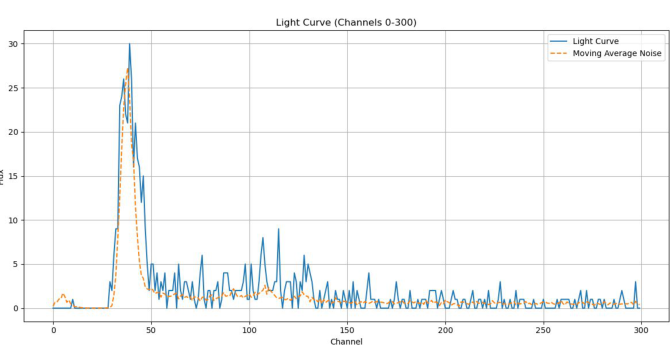
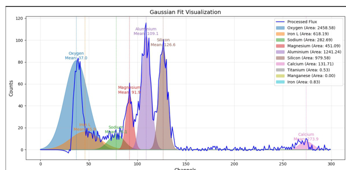
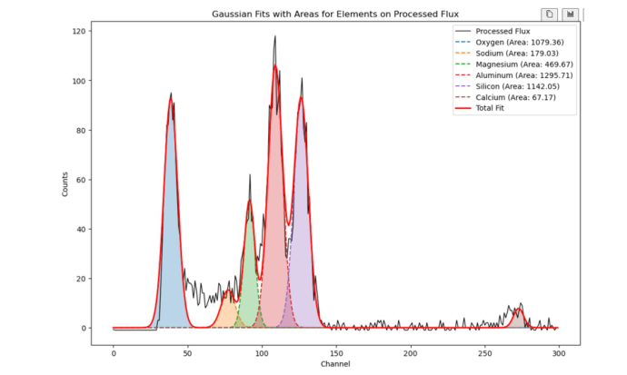

# 2. From a raw spectrum to a catalogue row

This document covers everything notebooks 01 and 02 do: how frames are triaged, how the background
estimates itself, why frames are summed before fitting, how ten overlapping lines are separated,
and where the uncertainty attached to every ratio comes from.

The two notebooks are the same pipeline. Notebook 02 sums eight consecutive frames and is what the
published maps are built from; notebook 01 sets the batch size to one and exists so that individual
spectra can be inspected without the co-addition step in the way.

---

## 2.1 Triage

Most frames are worthless, and deciding that cheaply is the first thing the pipeline does. Three
amplitude gates are applied to the peak height in the region where the light elements emit
(channels 40–400 of the truncated spectrum):

| Condition | Verdict | Effect |
|---|---|---|
| peak < 14 counts | Nothing there | Discarded |
| 14 ≤ peak < 25 | Quiet but clean | Folded into the background estimate |
| 25 ≤ peak < 70 | Real but too weak to fit | Discarded |
| peak ≥ 70 | Fittable | Background-subtracted and passed on |

A fourth check follows for frames that clear the top gate: the strongest feature anywhere in the
spectrum must exceed twice the standard deviation of the spectrum itself. Frames that fail it are
dropped. This catches spectra with elevated overall counts but no actual line structure — a raised
floor rather than fluorescence.

The middle band is the interesting one. Those frames carry no usable signal but are a perfectly
good sample of what the detector does when nothing is happening, which is exactly what the next
step needs.

---

## 2.2 A background that estimates itself

Every spectrum sits on a noise floor set by particle background and detector electronics, and that
floor drifts: it is measurably different at the end of an orbit from the start. Calibrating once
against a quiet frame and subtracting that constant everywhere leaves a residual that grows through
the pass, and because the residual is largest at low channels — exactly where oxygen, sodium and
magnesium live — it biases the elements that are hardest to fit anyway.

The pipeline instead maintains a running estimate that updates itself from the quiet frames:

```
background ← (1 − β) · background + β · quiet_frame
```

with β = 0.05 in notebook 02 and 0.03 in notebook 01. Small β means the estimate is slow and
steady; it absorbs genuine drift over tens of frames while ignoring the shot noise of any single
one. The estimate is also passed through a three-channel running mean before subtraction, which
removes single-channel spikes that would otherwise punch artificial holes into the subtracted
spectrum.

The run is seeded with a converged floor measured from real quiet frames (the literal array in the
notebook), so the first few hundred frames are subtracted against something sensible rather than
against zeros.



The dashed line is the running estimate; the solid line is the raw spectrum. The estimate follows
the floor without climbing into the emission peaks sitting on top of it — which is precisely the
separation the fitting step needs.

A useful diagnostic: after a full run, plot the converged background. It should look like a smooth
detector floor. If emission lines are visible in it, too many flare frames were classified as
quiet and the gates need raising.

---

## 2.3 Why eight frames

A half-second exposure does not collect enough photons for a ten-component decomposition to
converge. The weak lines — titanium, manganese, sodium — are at or below the noise in a single
frame, and a fit that cannot see them will redistribute their counts into whichever neighbour is
closest.

Summing frames fixes this, at an apparent cost in spatial resolution. Eight is chosen because eight
consecutive frames span approximately one native CLASS footprint, about 12.5 km. The sum therefore
covers roughly the area a single observation already covers, and the resolution cost is close to
nothing while the photon count in every line multiplies by eight.

Footprint corners and timestamps are averaged across the batch alongside the counts, so the
resulting row describes a single mean footprint and a single mean acquisition time.

This is also why sorted traversal matters: the eight frames must be adjacent along the ground
track for the averaged footprint to describe anything real.

---

## 2.4 Fitting ten overlapping lines

Each line is modelled as a Gaussian,

```
f(x) = A · exp( −(x − μ)² / (2σ²) )
```

and the spectrum is decomposed into ten of them. The difficulty is that they are not resolved.
They overlap, they sit on a floor that is still sloping after background subtraction, and their
amplitudes span two orders of magnitude — silicon and aluminium dominate while manganese is often
indistinguishable from noise. A single global fit across the whole spectrum diverges.



This is what a fixed fitting window produces. Oxygen has swollen to absorb the rising floor
beneath it; aluminium and silicon have been pulled off their true channels; the composite departs
from the data across the low-channel region. Every area derived from this decomposition is
meaningless, and — importantly — nothing in the fit *reports* that it failed. The optimiser
converged. It just converged on nonsense.

### Adaptive windows

The root cause is that how much of the spectrum you show the optimiser changes the answer. A wide
window pulls the continuum into the fit and biases the amplitude downward. A narrow window sees
mostly the peak but is at the mercy of noise at its edges. Neither is right for every line, and
the correct width also depends on local context that varies frame to frame.

So each line is fitted twice, once through a narrow window and once through a wide one, and the
candidates compete. For every line except oxygen the winner is the candidate whose fitted centre
μ lands closest to the line's theoretical channel. That rule is cheap, it requires no ground truth,
and it is a reasonable proxy for a sane fit: a Gaussian that has drifted off its physical channel
is fitting something other than the line it was supposed to fit.

The fitted centre is bounded to ±10 channels of the theoretical position and σ to a per-line range,
so a diverging fit fails outright rather than wandering into a neighbouring line.

Window half-widths, by line:

| Line | Narrow | Wide | σ bounds |
|---|---|---|---|
| O (38) | 2 | 7 | 0.1 – 5 |
| Fe L (53) | 3 | 7 | 0.1 – 7 |
| Na (77) | 3 | 7 | 0.1 – 9 |
| Mg (92) | 3 | 7 | 0.1 – 9 |
| Al (110) | 3 | 7 | 0.1 – 8 |
| Si (128) | 2 | 7 | 0.1 – 10 |
| Ca (273) | 3 | 7 | 0.1 – 9 |
| Ti (334) | 3 | 7 | 0.1 – 9 |
| Mn (436) | 2 | 7 | 0.1 – 9 |
| Fe K (474) | 2 | 6 | 0.1 – 9 |



With adaptive windows each component sits on its own channel and the composite tracks the data.
The individual areas are now usable as abundance proxies.

### The oxygen problem

Oxygen needs different treatment for two reasons: a large instrumental artefact sits immediately
below its line, and the noise floor is climbing steeply through that region. Any window that
extends to lower channels is dominated by the artefact rather than the line.

Two measures address it.

First, where the artefact's signature is detected directly — a sharp monotonic drop across channels
34 to 38 — the clean right-hand flank of the peak is mirrored back across the contaminated
channels before fitting. The oxygen peak is very nearly symmetric, so reconstructing its left half
from its right half is a defensible reconstruction rather than an invention.

Second, oxygen's window is offset to the high-channel side of the nominal centre, and the
selection rule inverts: instead of the candidate closest to the theoretical channel, the
*smallest-area* candidate wins. Contamination can only add area, so the faintest surviving
candidate is the one the artefact inflated least.

Oxygen remains the least trustworthy line in the set. Notebook 05 excludes it from the totals used
for the static overlays for exactly this reason.

### Failure is recorded, not hidden

A line whose fit does not converge contributes NaN. So does a line whose fitted area comes out
non-positive. Nothing is imputed, and no fallback value is substituted, so a failure propagates
visibly into the catalogue as a missing value rather than silently biasing a ratio.

---

## 2.5 Areas, ratios and uncertainty

The integral of the fitted Gaussian is the abundance proxy:

```
A = amplitude · σ · √(2π)
```

closed-form, so no numerical quadrature is involved.

### Normalising against silicon

Absolute line intensity depends on the strength of the driving flare, so raw areas from different
observations are not comparable. Every abundance is therefore reported as a ratio against silicon,
which is close to uniformly distributed across the lunar surface. Dividing by it cancels the flare
dependence and leaves a quantity that reflects composition rather than illumination.

The silicon overlay in `results/element_overlays/si_overlay_op40.png` is close to featureless,
which is the empirical support for the assumption — though it is worth being clear that this is
partly circular, since silicon is also the denominator in every other map.

### Where the ± comes from

The cost of normalising against silicon is that any contamination of the silicon line propagates
into all eight ratios. Because the lines overlap, some fraction of the counts attributed to one
element genuinely belongs to a neighbour, and near silicon this is not a small effect.

The overlap integral of two Gaussians has a closed form, and evaluating each line against silicon
gives a per-line contamination figure. That figure is turned into a fractional uncertainty on the
ratio:

```
Δ(E/Si) = (A_E / A_Si) · √( (O_E / A_E)² + (O_E / A_Si)² )
```

where `O_E` is the overlap integral of element E's Gaussian with silicon's. A floor of
`(A_E / A_Si) · 10⁻⁵` is applied so that no ratio ever claims to be exact.

This is the `±` figure that appears in the viewer tooltip. It should be read for what it is:
**a measure of spectral confusion between neighbouring lines, and nothing else.** Counting
statistics, calibration error and instrumental systematics are not included in it, so it is a
lower bound on the true uncertainty rather than a complete error budget.

---

## 2.6 What comes out

One CSV per source directory, one row per co-added batch. The schema is documented in
[`03-catalogue-schema.md`](03-catalogue-schema.md); concatenating the per-directory files gives
the catalogue that notebooks 03 and 05 consume.
