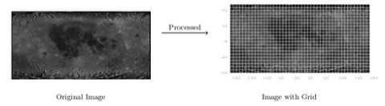
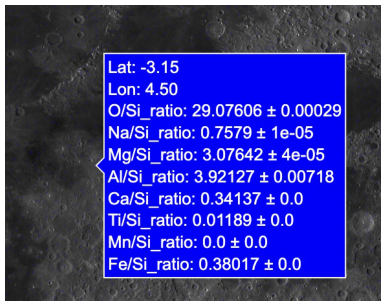

# 4. Regridding and rendering

Notebooks 03, 04 and 05 turn the catalogue into maps. This document covers the geometry problem
they solve and the two rendering paths that follow.

---

## 4.1 The geometry problem

The catalogue describes each observation as a quadrilateral with four independent corner
coordinates. That representation is faithful to what the instrument did and awkward for everything
that comes after it:

- **The footprints do not tile.** Successive observations along a ground track are not aligned to
  each other, let alone to a rectangular image grid. Projecting them onto a basemap pixel by pixel
  means intersecting polygons, per observation, every time anything is drawn.
- **They overlap, heavily.** At mid-latitudes, several orbital passes cover the same patch of
  surface. The naive resolution — last write wins — discards every measurement but one, which is
  the opposite of what those measurements are worth. Each pass is an independently fitted
  spectrum of the same ground.

Both problems disappear if the data is moved off the footprint geometry and onto a regular grid.

---

## 4.2 KD-tree regridding

The observation extent is covered with a uniform 0.1° × 0.1° latitude–longitude lattice. A
`scipy.spatial.cKDTree` is built over the catalogue's coordinates, and every lattice node asks it
the same question: *which observation is nearest to me?*

The important part is that the question is asked once, for all nodes at once:

```python
tree = cKDTree(df[["V0_lat", "V0_lon"]])
distances, indices = tree.query(grid_points)
```

This is a single vectorised batch query executing in compiled code. For several million nodes it
returns in about a second. The equivalent Python loop takes minutes, and would have to be rerun
every time the grid resolution changed.

Each node then inherits its nearest observation's element ratios and uncertainties, and nodes whose
nearest neighbour has no usable silicon fit are dropped outright, since nothing about them can be
normalised.



Irregular track geometry on the left; the uniform lattice it is recast onto on the right. What
comes out maps to pixel coordinates with a linear formula and needs no reprojection library.

### A caveat about the poles

Nearest-neighbour assignment has no notion of "too far". Where coverage is thin — and orbital
geometry combined with flare timing leaves the poles thin — a grid node will happily inherit from
an observation hundreds of kilometres away, and the resulting cell looks exactly as authoritative
in the viewer as one backed by a direct measurement. High-latitude cells should be read with more
scepticism than their tooltips suggest. Thresholding on the returned `distances` array would fix
this; the published pipeline does not do so.

---

## 4.3 Averaging the overlap

This is the step that turns redundancy into resolution.

After regridding, the same `(latitude, longitude)` node can appear more than once — once per
orbital pass that covered it. Those entries are grouped and averaged rather than deduplicated:

```python
grouped_df = df.groupby(["latitude", "longitude"], as_index=False).agg("mean")
```

Since each contributing entry came from a separately fitted spectrum, the mean is a better estimate
than any single pass, and the improvement is largest exactly where coverage is densest. The 0.1°
lattice is finer than the ~12.5 km native footprint, so compositional detail below the footprint
scale emerges wherever passes overlap — with no interpolation and no upsampling. The extra
information is real; it was simply spread across passes that a last-write-wins approach would have
thrown away.

Uncertainties are averaged alongside the values. Strictly, averaging *n* independent measurements
should shrink the uncertainty by roughly √n, so the values reported for well-covered cells are
conservative.

---

## 4.4 Pixel projection

Once the data is on a regular lattice, placing it on an equirectangular basemap is arithmetic:

```python
x_pixel = ((lon + 180) / 360) * img_width
y_pixel = ((lat - 90) / 180) * img_height
```

The latitude expression is matched to the axis range configured in notebook 04, where the y-axis
runs 0 to `img_height` with the basemap image anchored at its top. The two must change together —
altering one alone flips the map vertically, which is silent and easy to miss because the Moon is
roughly symmetric at a glance.

Image dimensions are read from the file rather than hard-coded, so a different mosaic can be
substituted without touching the projection.

---

## 4.5 The interactive viewer

At roughly 900,000 grid cells, the choice of rendering backend is the whole problem.

Plotly's default `Scatter` trace renders through SVG: the browser constructs one DOM node per
point, lays it out, and keeps it in the document. At ten thousand points the page is already
sluggish; at a hundred thousand it stops responding; at this dataset's scale the layout never
completes.

`Scattergl` routes the same data through WebGL. Point coordinates and per-point attributes are
uploaded once as compact vertex buffers into GPU memory, and the GPU draws all of them in parallel.
The CPU is not in the draw loop, so pan, zoom and hover stay interactive regardless of point count.

| Trace | Backend | Practical ceiling | Behaviour at this scale |
|---|---|---|---|
| `Scatter` | SVG, one DOM node per point | ~10,000 points | Never finishes laying out |
| `Scattergl` | WebGL, GPU vertex buffers | 10⁶+ points | Interactive |

**Why hover survives.** All eight ratio strings plus the coordinates ride along in the
`customdata` buffer, uploaded with the geometry at render time. When the pointer lands on a point,
the tooltip is filled from a buffer that is already resident — no event round trip, no server
request, no layout recalculation. That is also why the ratio and its uncertainty were packed into a
single `"value ± uncertainty"` string back in notebook 03: it halves the width of the buffer that
has to be uploaded.



**Why markers are one pixel.** At `size=1` each cell occupies the smallest area the display
allows, so visible density is a direct read-out of coverage: solid where many passes overlap,
individual lines across sparsely sampled terrain. Larger markers would blur that into a uniform
wash and imply coverage that does not exist.

The output is a single self-contained HTML file. It is large — the entire dataset is inlined —
but it opens in any browser with WebGL, offline, with no server.

---

## 4.6 The static overlays

Notebook 05 takes a different path. It works from the **raw footprint geometry**, not the regridded
lattice, and draws each catalogue row as the quadrilateral it actually was: four corners projected
to pixel space, outline stroked in a viridis colour keyed to that element's share of total fitted
flux, then alpha-composited onto the basemap.

Two choices are worth explaining.

**Outlines, not fills.** Stroking the quadrilateral rather than filling it is what gives the
published figures their woven texture. Overlapping tracks remain individually visible, so each map
doubles as a coverage plot — you can see where the data is thick and where it is a handful of
passes.

**Per-element normalisation.** Each map is normalised over its own observed range, which maximises
visible contrast within that element. The consequence is that **colours are not comparable between
two different element figures**. Only spatial patterns within one figure carry meaning.

The normalisation here is also different from the viewer's. Notebook 05 uses each element's share
of the summed area across all elements, with oxygen excluded because its fit is the least reliable
of the set (see [`02-spectral-pipeline.md`](02-spectral-pipeline.md#the-oxygen-problem)). The
viewer uses element/Si ratios. The two are not interchangeable, and a figure from one should not be
read against a tooltip from the other.

Element and opacity are set in one configuration cell at the top of the notebook; the published set
in `results/element_overlays/` was produced by re-running it once per combination.
